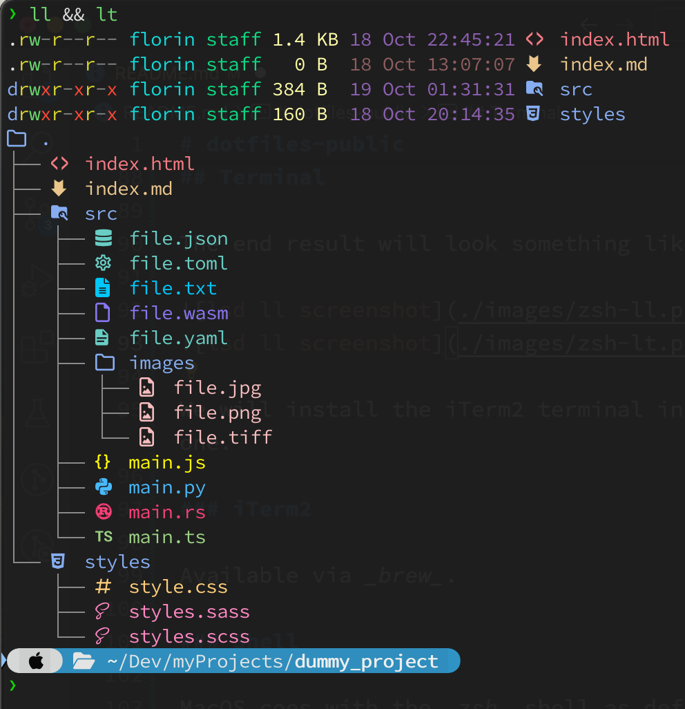

# dotfiles-public

Florin's MacBook development setup, so yeah, it's more than dotfiles.  
This might work on other platforms, some parts of it, maybe.

**Word of caution**: I recommend understanding my settings before applying them. Use them at your own risk!

## Contents

- [dotfiles-public](#dotfiles-public)
  - [Contents](#contents)
  - [Requirements](#requirements)
    - [brew](#brew)
    - [git](#git)
    - [font-patcher](#font-patcher)
    - [iTerm2](#iterm2)
    - [VsCode](#vscode)
  - [Fonts](#fonts)
  - [Terminal](#terminal)
    - [iTerm2](#iterm2-1)
    - [Shell](#shell)
      - [oh my zsh](#oh-my-zsh)
      - [Powerlevel10k](#powerlevel10k)
    - [Commands](#commands)
      - [lsd](#lsd)
      - [LS_COLORS](#ls_colors)
      - [vivid](#vivid)
  - [Code Editor](#code-editor)
    - [VsCode](#vscode-1)
  - [Links:](#links)

## Requirements

- brew
- git
- font-patcher
- iTerm2
- oh-my-zsh
- VsCode

### brew

Installs the main pieces of software on Mac.

### git

Install _git_ at this early stage as it may be required to install software.
Available via _brew_.

### font-patcher

In order to display symbols in the terminal, use the _font-patcher_ script to patch the fonts. It's available on the Nerd Fonts website, see the [_Links_](#links) section. It requires the _fontforge_ python script, available via _brew_.

### iTerm2

Terminal able to display symbols, colors, transparent backgrounds, etc.  
Available via _brew_.

### VsCode

Code editor maintained by MicroSoft.  
Available via _brew_.

## Fonts

Use monospaced fonts for the terminal or the code editor.  
The _fonts_ directory contains a few fonts that are already patched.  
Here are the steps involved:

1. Download

2. Patch

Download a font, then run the command here below. This will create a new patched font in the same directory.

Example:

```
❯ fontforge --script ../FontPatcher/font-patcher --complete JetBrainsMono-Regular.ttf
```

3. Add it to your Mac  
   Open _Font Book_ and simply _drag & drop_ the new patched font.

4. Add it to your Software  
   See the _Terminal_ or _Code editor_ sections for the patched font setup.

## Terminal

The end result will look something like the following:



We will install the iTerm2 terminal instead of the default one.

### iTerm2

Available via _brew_.

### Shell

MacOS coes with the _zsh_ shell as default. We'll work with that.  
Let's enhance it with some plugins and colors.

#### oh my zsh

Oh My Zsh is a delightful, open source, community-driven framework for managing your Zsh configuration.

- Install  
  The following command, run from the _$HOME_ directory, will install it via curl in the ~/.oh-my-zh directory:

```
sh -c "$(curl -fsSL https://raw.githubusercontent.com/ohmyzsh/ohmyzsh/master/tools/install.sh)"
```

- Configuration  
  The configuration file is ~/.zshrc  
  Note: every time we modify this file, in order to update the changes to the environment, we need to restart the terminal or run the following command:

  ```
  source ~/.zshrc
  ```

- Plugins  
  Example of the plugins section in the configuration file:
  ```
  plugins=(
  colored-man-pages
  deno
  git
  pip
  python
  rust
  vscode
  web-search
  )
  ```

#### Powerlevel10k

Powerlevel10k is a theme for Zsh, it enbelishes the _prompt_.

- Install  
  The follwing command install it via _git_.
  ```
  git clone --depth=1 https://github.com/romkatv/powerlevel10k.git ${ZSH_CUSTOM:-$HOME/.oh-my-zsh/custom}/themes/powerlevel10k
  ```
- Configure  
  Run the following command and then answer to the questions:
  ```
  p10k configure
  ```

### Commands

Let's add some more commands:

#### lsd

Clone of the _ls_ command with colorful output, file type icons, and more, written in Rust.  
We will use this instead of the standard _ls_.

- Install  
  Available via _brew_.

- Alias  
  Replace the _ls_ command by adding an alias in the ~/.zshrc file

  ```
  alias ls='lsd'
  ```

- Configuration  
  The configuration directory is ~/.config/lsd/

  1. modify options of the _ls_ command with the _config.yaml_ file.  
     Note: _lsd_ uses _crossterm_ so check their _Enum crossterm::style::Color_ section for the available colours. The options are some presets, RGB or ANSI colors. Check out the cheet sheet in the [_Links_](#links) section.

  2. use custom icons, by _name_, _extension_ or _filetype_ with the _icons.yaml_ file.  
     Just open _Font Book_ and _copy/paste_ symbols from the current font into this file.

  3. use custom colors for the _blocks_ with the _colors.yaml_ file.  
     Note: Now all the filetypes have the same color.  
     You can customize filetype colors using _LS_COLORS_ and other colors using the theme, see the [_LS_COLORS_](#ls_colors) section.

#### LS_COLORS

This is a collection of extension:color mappings, suitable to use as your LS_COLORS environment variable.

- Install  
  Just download the _lscolors.sh_ binary from their site, see the link in the [_Links_](#links) section, and copy it in the ~/.bin/ directory, for example.  
  We could stop here and add an entry in the ~/.zshrc file like so:
  ```
  # LS_COLORS
  source ~/.bin/lscolors.sh
  ```
  But we would like to customize these colors, so we'll use _vivid_, a generator for the _LS_COLORS_ environment variable, checkout the [_vivid_](#vivid) section for the details.

#### vivid

vivid is a generator for the _LS_COLORS_ environment variable that controls the colorized output of _ls_, _tree_, _fd_, _bfs_, _dust_ and many other tools.

- Install  
  Available via _brew_.

- Configuration  
   _vivid_ comes with several themes and the following command will show you the output for each theme.

  ```
  for theme in $(vivid themes); do
    echo "Theme: $theme"
    LS_COLORS=$(vivid generate $theme)
    ll ~/Documents/
    echo
  done
  ```

  There's a problem though: for each theme, all the files seem to have the same colour. We want different colours based on the file extension.  
  So we'll create our own theme, called _florin_, with the file _florin.yml_ and put it in the _~/.config/vivid/themes/_ directory. I'll start off from the _catppuccin_ theme and customize things.  
  We'll also add the default _filetypes.yml_ file so we can customize the _file types_ and put it in the _~/.config/vivid/_ directory.  
  Finally, we'll add the following line to the ~/.zshrc file.

  ```
  export LS_COLORS="$(vivid generate florin)"
  ```

## Code Editor

Many editors are available.  
I will start with _VsCode_.

### VsCode

- Install  
  Available via _brew_.

## Links:

- [Nerd fonts](https://www.nerdfonts.com/) - Iconic font aggregator, collection, and patcher.
- [Oh My ZSH!](https://ohmyz.sh/) - Framework for managing your Zsh configuration
- [Powerlevel10k](https://github.com/romkatv/powerlevel10k) - Theme for Zsh
- [Lsd](https://github.com/lsd-rs/lsd) - Clone of ls with colorful output, file type icons, and more
- [Crossterm](https://crates.io/crates/crossterm) - A crossplatform terminal library for manipulating terminals
- [Color cheat sheet](https://www.ditig.com/publications/256-colors-cheat-sheet) - List of 256 colors for Xterm prompt (console)
- [LS_COLORS](https://github.com/trapd00r/LS_COLORS) - A collection of extension:color mappings
- [vivid](https://github.com/sharkdp/vivid) - A generator for the LS_COLORS environment variable
